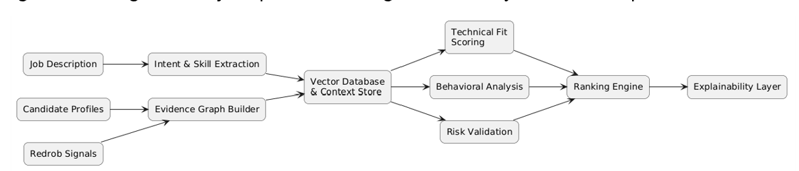
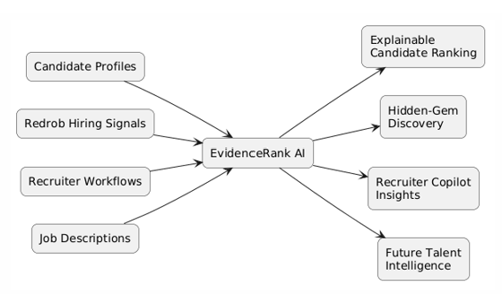

# EvidenceRank AI
### AI-Powered Candidate Discovery, Ranking, and Explainable Talent Intelligence

EvidenceRank AI is an intelligent candidate ranking system designed to process large-scale recruitment datasets and identify the most relevant, reliable, and hireable candidates for a given role.

The system follows an evidence-first approach that combines technical fit, behavioral signals, risk assessment, hidden-gem discovery, and explainable ranking to produce recruiter-friendly recommendations.

---

## Problem Statement

Recruiters often face thousands of candidate profiles for a single hiring requirement. Traditional keyword matching systems struggle to:

- Identify truly qualified candidates
- Detect misleading or low-quality profiles
- Surface hidden talent beyond obvious keyword matches
- Provide transparent reasoning behind rankings

EvidenceRank AI addresses these challenges through a multi-stage ranking pipeline designed to emulate recruiter decision-making at scale.

---

## Key Features

### Evidence-Based Ranking
Prioritizes verifiable evidence from career history, projects, skills, and candidate activity rather than simple keyword matching.

### Technical Fit Scoring
Evaluates candidate suitability using role-relevant skills, experience, and profile evidence.

### Behavioral Hireability Analysis
Incorporates recruiter engagement signals, responsiveness, profile activity, and hiring readiness indicators.

### Risk Detection Engine
Identifies potential ranking risks such as inconsistent profiles, inactivity, weak engagement signals, and low credibility indicators.

### Hidden-Gem Discovery
Surfaces strong candidates who may be overlooked by traditional search systems.

### Re-Ranking & Calibration
Applies recruiter-style pairwise comparisons and ranking adjustments to improve candidate ordering.

### Explainable AI
Generates transparent reasoning for every ranked candidate.

---

## Dataset

| Attribute | Value |
|------------|---------|
| Dataset Size | 100,000 Candidate Profiles |
| Format | JSONL |
| Candidate Attributes | Career History, Skills, Education, Certifications, Recruiter Signals |
| Processing Approach | Streaming Pipeline |
| Final Output | Top-100 Ranked Candidates |

---

## EvidenceRank AI Pipeline


### Pipeline Stages

1. Broad Candidate Retrieval
2. Evidence Extraction & Classification
3. Must-Have Qualification Filtering
4. Technical Fit Scoring
5. Risk Detection
6. Behavioral Hireability Analysis
7. Hidden-Gem Discovery
8. Pairwise Re-Ranking
9. Quality Calibration
10. Explainable Candidate Ranking

---

## System Architecture


---

## AI Logic Flow


---

## Data Flow



---

## Ecosystem Integration



---

## Results & Performance


### Processing Statistics

| Metric | Value |
|----------|---------|
| Candidates Processed | 100,000 |
| Final Ranked Candidates | 100 |
| Runtime | ~5 Minutes |
| Processing Environment | Google Colab |
| Throughput | ~333 Candidates / Second |

### Key Outcomes

- Large-scale candidate processing
- Explainable ranking generation
- Hidden-gem candidate discovery
- Risk-aware ranking methodology
- Recruiter-friendly reasoning output

---

## Technologies Used

### Core Development

- Python
- Pandas
- JSON
- Heapq

### Data Processing

- Streaming JSONL Processing
- Evidence Extraction
- Rule-Based Scoring
- Ranking Calibration

### Development Environment

- Google Colab
- GitHub

---

## Repository Structure

```text
EvidenceRank-AI
│
├── docs/
├── images/
├── outputs/
│
├── EvidenceRankAI_v5.ipynb
├── EvidenceRankAI_IndiaRuns_2026_TRACK1.pdf
├── requirements.txt
├── README.md
└── LICENSE
```

---

## Future Enhancements

- Embedding-Based Candidate Retrieval
- Vector Search Integration
- Learning-to-Rank Models
- Graph-Based Evidence Networks
- Multi-Agent Candidate Evaluation
- LLM-Powered Recruiter Copilot
- Real-Time Hiring Intelligence

---

## Disclaimer

This project was developed as part of the IndiaRuns × Redrob AI Candidate Ranking Challenge. The implementation focuses on demonstrating scalable candidate discovery, evidence-based ranking, and explainable AI concepts on large-scale recruitment datasets.

---
